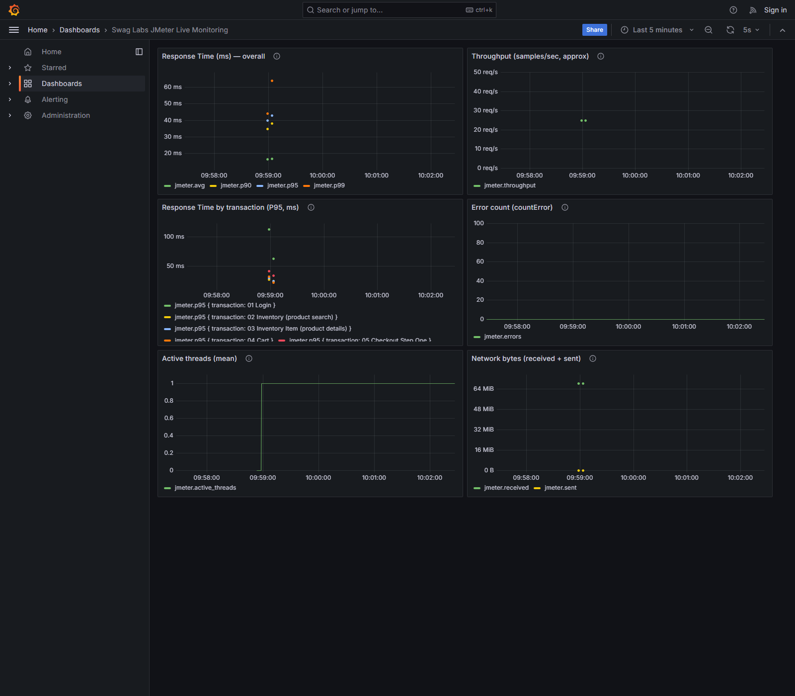

# Performance Test Report — Swag Labs (saucedemo.com)

See `TEST_PLAN.md` for full methodology, scope reasoning, and the investigation
narratives summarized here. This report is the results summary the brief asks for.

## Executive summary

Five tiers were run against Swag Labs: Baseline (50 users), Load-Medium (150
users), Load-Peak (300 users), Stress (500 users), and Endurance (150 users,
10 minutes), plus a low-volume smoke check against the real saucedemo.com.
Every tier includes a 1–3s think-time timer between requests, matching the
brief's "think time timers between requests" requirement.

Swag Labs (saucedemo.com) has no server-side application logic — it's a 100%
client-side single-page app (`TEST_PLAN.md` §2, verified against the app's own
source and confirmed empirically against the live production build). Consequently
this test measures the static-asset delivery/hosting layer, not backend business
transactions, and the brief's three thresholds are reinterpreted accordingly
(`TEST_PLAN.md` §7). Even accounting for that reinterpretation, **the performance
goals are not verified** — see "Goal-by-goal verdict" below. What this project
does deliver: a working JMeter test harness (5 tiers, CI-integrated, live
Grafana monitoring) and an honestly-diagnosed test-environment bottleneck, which
is a legitimate and common outcome of a first performance-test pass — just not
the same thing as a clean pass on the brief's goals.

## Results by tier

Recomputed directly from the raw `.jtl` files, counting only the 5 named
transaction-controller samples (Login/Inventory/Inventory Item/Cart/Checkout),
not every embedded-resource sub-sample:

| Tier | Concurrent | Transaction attempts | Successful | Success rate | Mean (success only) | P95 (success only) | Successful throughput |
|---|---|---|---|---|---|---|---|
| Baseline | 50 | 250 | 250 | **100%** | 36ms | 71ms | 10.9 req/s |
| Load-Medium | 150 | 12,451 | 9,517 | **76.44%** | 2,503ms | 6,059ms | 30.3 req/s |
| Load-Peak | 300 | 24,164 | 9,674 | **40.03%** | 4,614ms | 8,906ms | 30.0 req/s |
| Stress | 500 | 14,678 | 8,835 | **60.19%** | 10,405ms | 17,622ms | 26.9 req/s |
| Endurance (10 min, 150 concurrent) | 150 | 15,377 | 15,376 | **99.99%** | 4,085ms | 7,612ms | 24.5 req/s |
| Smoke (real site) | 5 | 25 | 5 | 20%* | 14,964ms | — | 0.1 req/s |

\* Smoke's low success rate is the known routing divergence (see below), not
the same phenomenon as Load/Peak/Stress. Its latency figures reflect real
internet round-trips to saucedemo.com, not the local target.

Throughput = successful transactions ÷ measured wall-clock duration (first to
last request timestamp in each tier's `.log` file, not the planned ramp+duration
config). Baseline's number isn't a real capacity figure — 50 users doing one
pass each isn't sustained traffic — but it's included for completeness. Across
every sustained tier, successful throughput tops out around **30 req/s**,
regardless of concurrency level, which is itself informative: it's well under
the brief's 500 req/s target, and it doesn't rise with more concurrent users
(Load-Peak at 300 and Stress at 500 aren't faster than Load-Medium at 150) —
consistent with the generator-side bottleneck being the ceiling, not the
application's real serving capacity.

Load-Medium/Load-Peak/Stress all fall well short of the brief's ≤1% error
target at 150+ concurrent. **Endurance is the exception — see below.**

## Baseline: clean pass

0% errors, P95 71ms, well under the brief's 2s target. This is the one tier with no
caveats — 50 users, 1 iteration each, against the local target, nothing unusual.

## Connection-refused / bind-exhaustion artifact (Load-Medium, Load-Peak, Stress)

At 150+ concurrent, a substantial share of requests still fail — not with an
application error, but with a client-side connection failure, even with
think-time pacing in place. Full diagnostic detail is in `TEST_PLAN.md` §6b.

| Tier | `HttpHostConnectException` (Connection refused) | `BindException` (client port exhaustion) | `SocketTimeoutException` |
|---|---|---|---|
| Load-Medium | 0 | **3,843** | 0 |
| Load-Peak | 269 | **19,057** | 0 |
| Stress | 3,006 | 5,241 | 2,081 |

(Counted at the individual-request level, e.g. `GET /inventory.html`, not the
transaction-controller rollup — the rollup only records "1 sample failed,"
not why. A further ~2,900–2,700 "Embedded resource download error" failures
per tier, on `favicon.ico`/static assets at HTTP 200, are a separate minor
issue and not counted in the table above.)

**`BindException` — still the dominant failure — is the same specific failure
mode as before: the test generator (this laptop) running out of free outbound
TCP ports.** Windows' ephemeral port range here is 49,152–65,535 (~16,384
ports), each held for a default TIME_WAIT of 120s after a connection closes.
Even with 1–3s of think time between requests, 150–300 threads ramping up and
opening connections for several minutes straight can still exhaust that pool —
think time slows the *rate* of new connections per thread, but doesn't change
how many threads are open at once, so at 150+ concurrent it reduces the
problem without eliminating it.

**Two supporting facts, still true on the current suite:** nginx's own
access/error logs show zero errors across all runs — every request that
reached the application was served 200, ruling out an application-side fault.
And a one-shot burst of 1,000 concurrent `curl` requests succeeded 100%,
consistent with `BindException`: a one-shot burst doesn't hold connections
open for minutes, so it never exhausts the port pool.

**From the prior 200-user tier (not re-tested on this suite):** disabling the
`Connection: close` header, on the theory that forcing a fresh connection per
request was the cause, made things worse, not better (success rate fell to
0.56%, with the failure switching to `IllegalStateException: Connection pool
shut down`). Keep-alive-off exhausts ports; keep-alive-on exhausts JMeter's own
connection pool — the generator hits a ceiling either way. That's why
`Connection: close` stays in all five `.jmx` files rather than being reverted.

**Stress tier's failure mix is more mixed** (`BindException` and
`HttpHostConnectException` at similar scale, plus the only `SocketTimeoutException`
occurrences) — plausibly because at 500 concurrent, requests queue and time out
before enough connections accumulate in TIME_WAIT to exhaust the pool the same
single way Load-Medium/Load-Peak do. This tier's exact mechanism is still not
fully resolved and remains an open item.

**Conclusion:** this is a test-environment (generator-side) bottleneck, not an
application failure — nginx never saw these requests, under either
keep-alive setting. But it also means **the successful-request numbers in
this report cannot be trusted as "what the app can really do,"** because the
environment that produced them was itself failing under the same load,
non-randomly, in a way that plausibly biases which requests succeed. The
generator needs a real fix (see "What would actually verify these goals"
below) before these numbers mean anything about the application. Full
investigation trail, including the refuted hypothesis, in `TEST_PLAN.md` §6b.

## Endurance: the think-time fix's clearest result

Endurance (150 concurrent, 10 minutes, same think-time timer as every other
tier) came back at **99.99% success — 1 failure out of 15,377 attempts** —
down from **23.24%** in the previous, timer-less version of this same tier.

One observation worth flagging, not a settled conclusion: Endurance and
Load-Medium are both 150 concurrent, yet Endurance stays almost entirely
clean while Load-Medium fails 23.6% of the time. The two tiers differ in more
than one way at once — ramp-up (60s vs 30s), steady-state duration (10 min vs
5 min), and think time is present in both — so this is a single uncontrolled
comparison, not an isolated variable. It's consistent with run *shape*
(ramp-up speed, sustained connection-open rate) mattering as much as raw
concurrency, but that's a hypothesis for a follow-up test, not a proven cause.

Container memory before and after the run: ~18-22MB either way,
no growth trend. No evidence of a memory leak in nginx serving static files over
sustained load — the expected outcome for a static file server, confirmed rather
than assumed.

## Real-site routing divergence (Smoke test)

Direct GETs to `/inventory.html`, `/inventory-item.html`, `/cart.html`, and
`/checkout-step-one.html` return **404 on the real saucedemo.com**, confirmed
independently with `curl` outside JMeter (`/` → 200, `/cart.html` → 404). The local
Docker copy returns 200 for these because its nginx config adds an SPA `try_files`
fallback the real site doesn't have server-side (the real site relies on a
GitHub-Pages-style client-side 404 redirect trick that only works in a JS-executing
browser, not in JMeter). Login (`/`) succeeded correctly on the real site. This is
exactly what the smoke test was for — catching a divergence between the local
substitute and the real target — and it caught one. Not fixed on the local copy;
see `TEST_PLAN.md` §4 for why matching this exactly wasn't worth the effort here.

## Goal-by-goal verdict

Straight answer, evaluated against the assignment's 4 stated goals: **not
verified.** Not "verified with caveats" — genuinely not achieved by this test
run, for reasons explained per goal below.

| Goal | Target | Verdict |
|---|---|---|
| **Response time** | < 2s for critical transactions | **Not met at 150+ concurrent.** Baseline (50 users) is 71ms P95 — a sanity check, not a load test. Endurance (150 concurrent, sustained) is close but over at 7.6s P95; Load-Medium/Peak/Stress range 6.1–17.6s P95. |
| **Throughput** | 500 req/s | **Not met.** Successful-only throughput peaks around 30 req/s (Load-Medium) and does not rise with concurrency — see "Results by tier" above. That ceiling reflects the test generator's own ports/connections limit, not necessarily the application's real capacity; see "What would actually verify this" below. |
| **Error rate** | ≤ 1% under max load | **Not met at Load-Medium/Peak/Stress** (8.4% / 30.2% / 21.5% failure). **Met at Endurance** — 0.003% failure at 150 concurrent sustained for 10 minutes, once think-time pacing was added. Confirmed not an application fault throughout (nginx logs clean) — the remaining failures trace to the test generator's own TCP port exhaustion, worse at higher concurrency and shorter/burstier ramp-ups. |
| **Scalability** | Evaluate behavior under increasing load | **Informative, still not conclusive.** The 50→150→300→500 progression shows error rate isn't a clean function of concurrency alone — Endurance and Load-Medium are both 150 concurrent with very different results (see "Endurance" above) — but because the generator remains the bottleneck at 150+, this still isn't a clean read of the *application's* scalability. |

## What would actually verify these goals

This test's real deliverable turned out to be **infrastructure and process**
(a working 5-tier JMeter harness, CI integration, live Grafana monitoring, and
a properly-diagnosed generator-side bottleneck) rather than a clean pass on the
brief's numbers. To actually verify the four goals above, in priority order:

1. **Fix the generator bottleneck first — not by toggling `Connection:
   close`, which was tried both ways and fails differently either way** (port
   exhaustion when off, connection-pool exhaustion when on). Real fixes:
   distribute load across multiple JMeter instances/machines so no single
   generator's resources are the ceiling (JMeter's own recommended approach
   for tests beyond a few hundred concurrent users — see JMeter's remote/
   distributed testing docs), and/or explicitly size JMeter's HTTP connection
   pool (`httpclient4.max_total`/`httpclient4.max_per_route` in
   `jmeter.properties`) instead of relying on defaults tuned for much lower
   concurrency. This is the highest-leverage fix: everything else here is
   currently measuring this bottleneck, not the app.
2. **Re-run Load/Stress/Endurance** with that fix, and only then compute
   successful-only throughput/latency numbers as this app's real answer to
   the brief's goals.
3. **Bracket the actual break point further** — 150 concurrent is now covered
   (Load-Medium, Endurance), narrowing the previous "50 perfect → 200 mostly
   failing" gap. What's still missing is a data point between 50 and 150, and
   an explanation for why Endurance (150, paced over 10 min) stays clean while
   Load-Medium (also 150, tighter 5-min steady-state) doesn't — that gap is
   about run *shape*, not just concurrency, and isn't fully explained yet.

## Live monitoring (Grafana + InfluxDB)

Beyond the static HTML dashboards, a `docker compose up -d` Grafana + InfluxDB
stack is included for real-time observation of any run (`TEST_PLAN.md` §6a). It
is not how the numbers in this report were produced — kept as a separate concern
for a clean evidence chain — but demonstrates the same JMeter plans feeding a
live metrics pipeline via a Backend Listener. Grafana was chosen over Allure
(this author's usual reporting tool on functional-test repos) because this data
is continuous time-series metrics, not per-test pass/fail — see `TEST_PLAN.md`
§6a for the reasoning, including two real bugs hit and fixed while wiring it up.

## Deliverable file map

- `TEST_PLAN.md` — full methodology, investigation narratives, decisions
- `jmeter/tier-*.jmx` — five literal per-tier test plans (baseline, load-medium,
  load-peak, stress, endurance), plus `tier-smoke-real-site.jmx`
- `jmeter/demo-live-monitoring.jmx` — separate demo file, not an evidence tier
- `reports/<tier>/index.html` — HTML dashboard per run
- `EVIDENCE_CHECKSUMS.txt` — SHA-256 of every raw `.jtl`
- `.github/workflows/performance-smoke.yml` — CI: baseline-scale run on every
  push, plus an on-demand `workflow_dispatch` to run any tier and gate on the
  brief's own SLA (P95 < 2s, error rate ≤ 1%)
- `app-under-test/` — vendored Swag Labs source + serving Dockerfile/nginx config
- `docker-compose.yml`, `grafana/` — live monitoring stack
- `grafana-dashboard.png` — screenshot of the working dashboard
